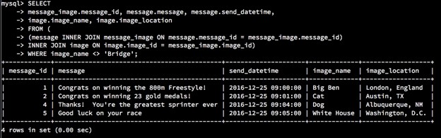

# **Table of Contents**
1. Professional Self-Assessment
2. Code Review
3. Software Design and Engineering - Artifact 1: Inventory Management Application Enhancement
4. Algorithms and Data Structure - Artifact 2: Hash Table Lab Enhancement
5. Databases - Artifact 3: SQL Database Report Enhancement


# **1. Professional Self-Assessment**

Throughout my time working towards my degree, I have completed a number of different assignments touching on many facets of computer science and software engineering. I have worked with a team using Git to alter, enhance, and update code on a multi-branched tree, studied agile and scrum methodologies, and worked with various data structures and algorithms to create an assortment of different programs. I have assessed code for security vulnerabilities and created a full security report with recommendations for improvement and best practices to adhere to for theoretical company stakeholders. I have reverse engineered assembly code into functional C++, built a full Android application for product inventory management, and worked with a number of databases to not only query but perform other tasks like building a forward-facing user interface with Python code. Every course presented a new challenge to undertake, lesson to learn, and skill to add to my repertoire. This collection is intended to highlight just a few of my strengths that I have acquired throughout my time in this program, but know that there are plenty of other projects that I would have loved to have included as well.

For this ePortfolio, I was tasked with selecting artifacts in three major categories: software design and engineering, algorithms and data structure, and databases. The artifact chosen for software design and engineering is my final project from my CS-360 Mobile Architecture and Programming course. It is a mobile inventory management application created for the Android OS environment using Java as its primary language, for this portfolio I have converted the application’s code to Kotlin to demonstrate my ability to work with multiple languages and translate from one to another. The second artifact, for algorithms and data structure, is a select file from my final portfolio from my CS-260 Data Structures and Algorithms course. The file itself uses a hash table to store and query a dataset, and for this portfolio I have tried my hand at optimizing said code by rewriting it to use iterators in its core functionality. And the final artifact for databases is an extension of my final database report from my DAD-220 Introduction to SQL course. The original file is a report based on a number of actions we were asked to perform with a specific dataset, but the artifact itself is a database of my own creation and a new database using the skills I learned in said course and a number of different types of queries using it.


# **2. Code Review**
You can find my initial code review at the following link: [Code Review](https://youtu.be/igXro7HJSLM)


# **3. Software Design/Engineering**

The artifact chosen for the software design and engineering portion of the ePortfolio is the final project from my CS-360 Mobile Architecture and Programming course in July/August of 2022. The project itself is a mobile application intended to be used by a small/medium business or individual seller for product inventory management. It uses a grid-based view to display input products, stores and displays a number of related informative aspects like name and price, has user profiles with associated credentials (including functionality to login or signup), and allows for C.R.U.D. functionality with all related data. This was one of three options for the project, and it was developed in Android Studio using Java as its primary programming language.
	
I selected this item for my ePortfolio as it is the most complete application I have developed during my time in the computer science program and it falls within the criteria for the software design and engineering category. I believe this artifact showcases my ability to work with the Java language as well as my ability to create more complex programs, working with various interconnected classes and functions, working with mobile architecture, and my ability to design user-friendly interfaces for interacting with applications. In terms of improvements to the existing artifact, I took the time to go through and clean up the existing code, adding in a bit more clarity in readability as well as cutting down on redundancies. I also took time to make the user-interface more accessible as well as fixing existing errors in the program that could have created issues in compiling or potentially with security if left unchecked.
	
The course objective was to take the artifact and enhance it in some form or fashion, and in addition to the minor improvements I added to the existing code, the primary enhancement I chose to perform on this project was to convert the existing code from the Java language to Kotlin. I chose to translate the project to Kotlin as it is the only other language officially supported by Google for Android development, and while I am fresh to this language, it does share a number of similarities to Java, and I took it as a personal challenge. This was one of the presented options for potential enhancements to perform with our chosen artifacts, and this would meet the objective of demonstrating an ability to use well-founded and innovative techniques, skills, and tools in computing practices for the purpose of implementing computer solutions that deliver value and accomplish industry-specific goals as well as developing with a security mindset.

### Code Examples ###

Original Java:
```
//Register and Sign In User
    public User findUser(String username,String password){
        String[] projection = {COLUMN_USERNAME, COLUMN_PASSWORD};

        String selection = "username =\"" +username +"\" AND password=\""+password +"\"";

        Cursor cursor = myCR.query(UserContentProvider.CONTENT_URI, projection,selection, null,null);

        User user = new User();
        System.out.println(cursor.moveToFirst());
        if(cursor.moveToFirst()){
            cursor.moveToFirst();
            user.setUsername(cursor.getString(0));
            user.setPassword((cursor.getString(1)));
            cursor.close();
        }else{
            user =null;
        }
        return user;
    }
    public boolean addUser(User user){
        ContentValues values=new ContentValues();
        values.put(COLUMN_USERNAME, user.getUsername());
        values.put(COLUMN_PASSWORD, user.getPassword());

        myCR.insert(UserContentProvider.CONTENT_URI,values);
        return true;
    }
```


Kotlin Version:
```
//Register and Sign In User
    fun findUser(username: String, password: String): User? {
        val projection = arrayOf(COLUMN_USERNAME, COLUMN_PASSWORD)
        val selection = "username =\"$username\" AND password=\"$password\""
        val cursor = myCR.query(UserContentProvider.CONTENT_URI!!, projection, selection, null, null)
        var user: User? = User()
        println(cursor!!.moveToFirst())
        if (cursor.moveToFirst()) {
            cursor.moveToFirst()
            user!!.username = cursor.getString(0)
            user.password = cursor.getString(1)
            cursor.close()
        } else {
            user = null
        }
        return user
    }

    fun addUser(user: User): Boolean {
        val values = ContentValues()
        values.put(COLUMN_USERNAME, user.username)
        values.put(COLUMN_PASSWORD, user.password)
        myCR.insert(UserContentProvider.CONTENT_URI!!, values)
        return true
    }
```
	
The process of enhancing this artifact was a genuine trial. I have very little experience with translating from one programming language to another, and what little I do have is largely reverse engineering work taking assembly and turning it into C++. I debated on translating the project from Java into Python or C++, as I have more experience with both of the latter languages. But, using either for an Android application was proving to be somewhat troublesome as there is no direct way of doing so that I could immediately find, and finding a proper IDE to put it all together was becoming a headache. As previously stated I have no experience with Kotlin prior to taking on this endeavor, and so I had to do a fair bit of research into how the language works, how to translate from Java, what kind of IDE I would need to be working with, and more. Luckily, Android Studio does have some conversion software built in, and this assisted with a good deal of the translation, though it was definitely not a one-to-one instant transformation. Following the initial conversion, a number of errors appeared in the new iteration of the project, and I had to spend a fair deal of additional time researching these errors and correcting them in order to gain the same functionality and ensure the program would compile.

### Links ###

Original Inventory Management Application Project (Java): 

[CS-360 Final Project - Inventory Management Application](https://github.com/EricWHarden/EricWHarden.github.io/blob/main/Eric%20Harden_CS-360_7-2%20Project%20Three.zip)

Cleaned Up Inventory Management Application Project (Java): 

[Inventory Management Application - Initial Updates](https://github.com/EricWHarden/EricWHarden.github.io/blob/main/Eric%20Harden_CS-499_3-2%20Milestone%20-%20Original%20Artifact%20w%20Updates.zip)

Enhanced Inventory Management Application Project (Kotlin): 

[Inventory Management Application - Kotlin Version](https://github.com/EricWHarden/EricWHarden.github.io/blob/main/Eric%20Harden_CS-499_3-2%20Milestone%20-%20Kotlin%20Ver.zip)

 

# **4. Algorithms and Data Structure**

The artifact chosen for the algorithms and data structure portion of the ePortfolio is my final portfolio submission from my CS-260 Data Structures and Algorithms course in October/November/December of 2020. The portfolio itself was a collection of the various labs we performed throughout the term, each focusing on a particular type of algorithm/data structure. Each lab worked around a central file and the goal was to create a different type of structure for organizing and interacting with the data within, offering the ability to insert, remove, search, and print said data. Of these various labs, I have chosen to work with the particular file where we constructed a hash table and enhance it. The file is written in C++ as its primary programming language.

I selected this item for my ePortfolio as it, taken as a whole, was an early example of not only working with C++, but also because it acts as a showcase of my experience working with various data structures in small, bite-sized programs. In terms of improvements to the existing artifact, I first attempted to assess what could be done with the hash table file to attempt to improve its performance. After extensive research, I found that my existing file had largely implemented many of the types of enhancements I was searching for. So, I spent time trying to clean up the existing file and further add to its readability before finally deciding to try my hand at outright rewriting it. The goal ultimately became to not only cut down on the amount of code but to further add to its efficiency by adding in iterators to many of its key functions.

The course objective was to take the artifact and enhance it in some form or fashion, and in addition to the minor improvements I added to the existing code, the primary enhancement I chose to perform on this project was to rewrite the code for the existing functionality with iterators in an attempt to improve efficiency, as well as some other small functionality I was unsure of being implemented originally. I have very little to no experience working with iterators, I cannot recall a point where a course actually touched on them (though I have to believe that is not true), and so I took it as a challenge to further my understanding of C++ as a language and a test of my ability to implement it. The presented options for this particular artifact were to either improve the code’s efficiency or expand its complexity, and while I did consider outright translating the program to another language much like the first artifact for software design and engineering (in this case from C++ to Python), I do think that I ultimately achieved both of these types of enhancements. This artifact also meets the course outcome of designing and evaluating computing solutions that solve a given problem using algorithmic principles and computer science practices and standards appropriate to its solution, while managing trade-offs involved in design choices.

### Code Examples ###

Original Hash Table:

```
/**
 * Insert a bid
 *
 * @param bid The bid to insert
 */
void HashTable::Insert(Bid bid) {
    // FIXME (5): Implement logic to insert a bid

	//Calculate the key for this bid
	unsigned key = hash(atoi(bid.bidId.c_str()));

	//Try to retrieve node using key
	Node* oldNode = &(nodes.at(key));

	//If no entry found for this key
	if (oldNode == nullptr){
		Node* newNode = new Node(bid, key);
		nodes.insert(nodes.begin() + key, (*newNode));
	}else{
		//Node found
		if (oldNode->key == UINT_MAX){
			oldNode->key = key;
			oldNode->bid = bid;
			oldNode->next = nullptr;
		}else{
			//Find the next open node (last one)
			while (oldNode->next != nullptr){
				oldNode = oldNode->next;
			}
			oldNode->next = new Node(bid, key);
		}
	}
}
```


Enhanced Hash Table:

```
/*
* Attempted revise of Insert function using iterators
*/
void HashTable::insertBid(int key, Bid bid) {
    int hashValue = hashFunction(key);
    auto& cell = table[hashValue];
    auto beginItr = begin(cell);
    bool keyExists = false;
    for (; beginItr != end(cell); beginItr++) {
        if (beginItr->first == key) {
            keyExists = true;
            beginItr->second = bid;
            cout << "[WARNING] Key exists. Value replaced." << endl;
            break;
        }
    }

    if (!keyExists) {
        cell.emplace_back(key, bid);
    }
    return;
}
```

The process of enhancing this artifact was a little frustrating. I thought that because the program itself is not overly complex that finding a way to enhance the core data structure’s efficiency would be easily researchable. Turns out, a lot of the information I could find was largely theory without much in the way of examples or clear cut solutions. A hash table is simple in concept, it implements a structure that maps keys to values, then uses a hash function to compute an index into an array of buckets and slots where it stores data. The key is hashed during a search where the resulting hash tells us where its corresponding data is housed. Improving the efficiency of a hash table comes down to how many buckets it has and how it stores its data. To my knowledge there are two types of hash tables, one employs open addressing, and the other employs separate chaining, both are manners in which it deals with collisions. I chose to attempt to rewrite the code in a similar manner to the original (including some of the original code) where it would use separate chaining with linked lists to deal with said collisions. Additionally, when rewriting the various functions, I chose to implement iterators as previously stated. This was to help the program validate existing keys and to attempt to help improve its efficiency in navigating the table for its various functions. This all being said, I have some work to do, the program is not yet to a functional state. I believe I have done a lot of the legwork in getting it moving in the right direction, but there are still some discrepancies like the node structure that houses bids in the original program and if that can be integrated into the new model or if I need to find a workaround. As it is, however, I have cut down the program by roughly fifty lines of code, and I believe that it should have improved performance once fully complete.

### Links ###

Original Artifact File: [CS-260 Hash Table](https://github.com/EricWHarden/EricWHarden.github.io/blob/main/EricHarden_CS-260_HashTable.cpp)

Updated Artifact File: [CS-260 Hash Table - Updated](https://github.com/EricWHarden/EricWHarden.github.io/blob/main/EricHarden_CS-260_HashTable%20-%20Updated.cpp)

Enhanced Artifact File: [CS-260 Hash Table - Enhanced](https://github.com/EricWHarden/EricWHarden.github.io/blob/main/EricHarden_CS-260_HashTable%20-%20Enhanced.cpp)


# **5. Databases**

The artifact chosen for the databases portion of the ePortfolio is my final submission from my DAD-220 Introduction to SQL course in May/June of 2019. This final project was a database management report, essentially taking the database we had been working with throughout the term and performing a series of specified tasks. This project used my SQL for queries and implementation, specifically working with MySQL. I had originally planned to work with my final project from CS-340, as shown in my initial code review, but determined I was missing too many of the original resources to complete a proper enhancement in the allotted time.

I selected this item for my portfolio as it was my first experience working with databases and SQL, of which there have only been a few instances throughout my time in the computer science program. As such, I found it to be a good springboard for further work with SQL specifically and ultimately the creation of a new artifact based on its initial blueprint. So, I have taken the artifact and used what I learned from it to create a new database and perform various similar tasks with it for submission into my ePortfolio. The new artifact is a custom database related to some of my family’s favorite pieces of media, along with an accompanying database management report showcasing my ability to use SQL in this manner. I believe that this is an important portion of my ePortfolio as SQL is a skill in demand and it explicitly acts as a demonstration of my knowledge with it.

The course objective was to take the artifact and enhance it in some form or fashion, and I used this artifact as a springboard to take the concepts within and create my own project out of it. Seeing as the new artifact is transformative, I do believe it meets the criteria of the course objective. In my coinciding database management report, I did try to perform some more complex query methods in addition to some that were already outlined in the original.

### Example SQL and Query Images ###

Samples From Original Database Report:





Sample From New Database Creation:

```
DROP DATABASE IF EXISTS `sql_family_favorites`;
CREATE DATABASE `sql_family_favorites`; 
USE `sql_family_favorites`;

SET NAMES utf8 ;
SET character_set_client = utf8mb4 ;

CREATE TABLE `family_members` (
  `family_member_id` int(11) NOT NULL AUTO_INCREMENT,
  `first_name` varchar(50) NOT NULL,
  `last_name` varchar(50) NOT NULL,
  `birth_date` date DEFAULT NULL,
  PRIMARY KEY (`family_member_id`)
) ENGINE=InnoDB AUTO_INCREMENT=5 DEFAULT CHARSET=utf8mb4 COLLATE=utf8mb4_0900_ai_ci;
INSERT INTO `family_members` VALUES (1,'Eric', 'Harden', '1992-09-30');
INSERT INTO `family_members` VALUES (2,'Joie', 'King', '1991-10-17');
INSERT INTO `family_members` VALUES (3,'Jaiden', 'Jackson', '2010-09-08');
INSERT INTO `family_members` VALUES (4,'Selah', 'Jackson', '2012-12-28');


CREATE TABLE `favorite_movies` (
  `movie_id` int(11) NOT NULL AUTO_INCREMENT,
  `family_member_id` int(11) NOT NULL,
  `name` varchar(50) NOT NULL,
  `release_date` date DEFAULT NULL,
  `age_rating` varchar(50) NOT NULL,
  `metacritic_score` int(11) NOT NULL DEFAULT '0',
  PRIMARY KEY (`movie_id`)
) ENGINE=InnoDB AUTO_INCREMENT=17 DEFAULT CHARSET=utf8mb4 COLLATE=utf8mb4_0900_ai_ci;
INSERT INTO `favorite_movies` VALUES (1,'1', 'Alien', '1979-06-22', 'R', '89');
INSERT INTO `favorite_movies` VALUES (2,'1', 'The Thing', '1982-06-25', 'R', '57');
INSERT INTO `favorite_movies` VALUES (3,'1', 'There Will Be Blood', '2007-12-26', 'R', '93');
INSERT INTO `favorite_movies` VALUES (4,'1', '2001: A Space Odyssey', '1968-04-02', 'G', '84');
INSERT INTO `favorite_movies` VALUES (5,'2', 'Monster-in-Law', '2005-05-13', 'PG-13', '31');
INSERT INTO `favorite_movies` VALUES (6,'2', 'The Notebook', '2004-06-25', 'PG-13', '53');
INSERT INTO `favorite_movies` VALUES (7,'2', 'P.S. I Love You', '2007-12-21', 'PG-13', '39');
INSERT INTO `favorite_movies` VALUES (8,'2', 'Ever After', '1998-07-31', 'PG-13', '66');
INSERT INTO `favorite_movies` VALUES (9,'3', 'Venom', '2018-10-05', 'PG-13', '35');
INSERT INTO `favorite_movies` VALUES (10,'3', 'Pacific Rim', '2013-07-12', 'PG-13', '65');
INSERT INTO `favorite_movies` VALUES (11,'3', 'Godzilla (2014)', '2014-05-16', 'PG-13', '62');
INSERT INTO `favorite_movies` VALUES (12,'3', 'Black Panther', '2018-02-16', 'PG-13', '88');
INSERT INTO `favorite_movies` VALUES (13,'4', 'Frozen (2013)', '2013-11-27', 'PG', '75');
INSERT INTO `favorite_movies` VALUES (14,'4', 'The Incredibles', '2004-11-05', 'PG', '90');
INSERT INTO `favorite_movies` VALUES (15,'4', 'Minions', '2015-07-10', 'PG', '56');
INSERT INTO `favorite_movies` VALUES (16,'4', 'Encanto', '2021-11-24', 'PG', '75');
```


Sample Queries From New Report:


The process of enhancing this artifact was a challenge. I was struggling with this particular portion of the ePortfolio and was having issues coming up with a solution for my previously selected artifact, in part because I have not worked with dedicated database materials in quite some time. So, I decided to go back to basics, refresh myself on MySQL, and ultimately decided to switch to this artifact. This still presented a problem, as nearly every existing option I had for databases was lacking the bulk of the necessary materials to actually work with it, and so I decided to use the artifact as guidance in creating and working with a new database of my own creation. I feel like the entire experience was a learning one. It has been so long since I have worked with a database in this manner that it was a process of learning how to use the MySQL Workbench, how to create a new database and initially populate it, and relearning how to perform various queries and commands.

### Links ###

Original Database Report, New Database Report, and Custom Database: [Databases Artifact](https://github.com/EricWHarden/EricWHarden.github.io/blob/main/Eric%20Harden_CS-499_5-2%20Milestone%20Four%20-%20Enhancement%20Three%20-%20Databases.zip)


